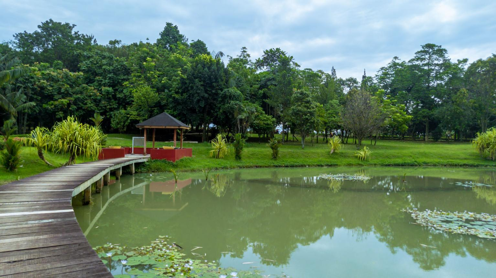
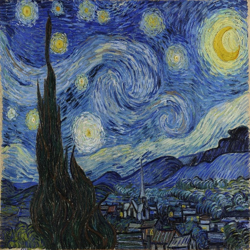
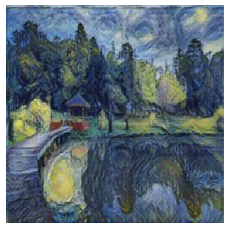
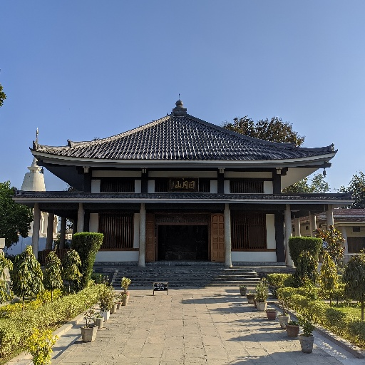
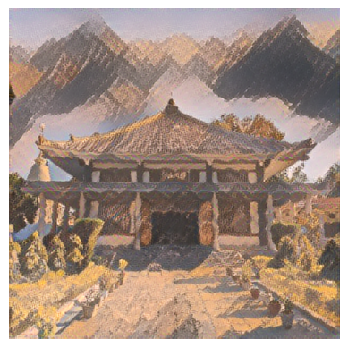
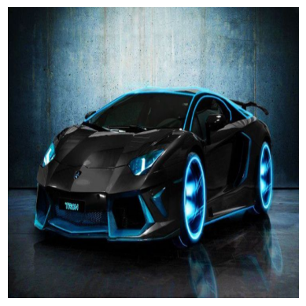
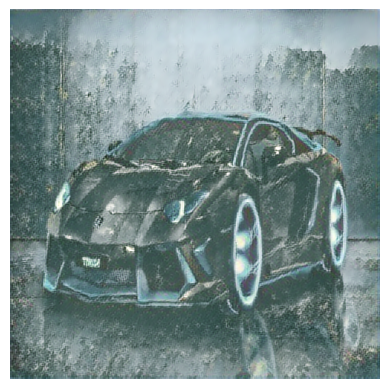

## Neural style transfer using Tensorflow hub

Neural Style Transfer (NST) is a deep learning technique that combines the content of one image with the artistic style of another image to create a new stylized image. This project uses TensorFlow Hub's pre-trained Arbitrary Image Stylization model to perform fast and high-quality style transfer

### Overview:

 [content_1](content_1.jpg) ,[content_2](content_2.jpg) , [content_3](content_3.png) : Defines the structure and objects

 
 [style_1](style1.jpg) , [style_2](style2.jpg) , [style_3](style3.jpg) :  Defines colors, textures, and artistic patterns

 [Image Preprocessing](Image_preprocessing.py): Image preprocessing of content and style images with functions in [Load images](Load_images.py) before feeding to the hub model.

 [VGG hub model](VGG_hub_model.py) : Loading of Pretrained VGG model for Neural style transfer from tensorflow hub.
 
  After feeding the preprocessed images (Content and style) to the tensorflow hub model and fine tuning is done and outputs the stylized images.

  

   
### Results: 

[Gen1](Gen_1.jpg) , [Gen2](Gen_2.jpg) , [Gen3](Gen_3.jpg): Outputs the content while adopting the artistic style.

## Neural Style Transfer Results

| Content Images | Style Images | Results |
|:--------------:|:------------:|:-------:|
|  |  |  |
|  |  |  |
|  |  |  |
